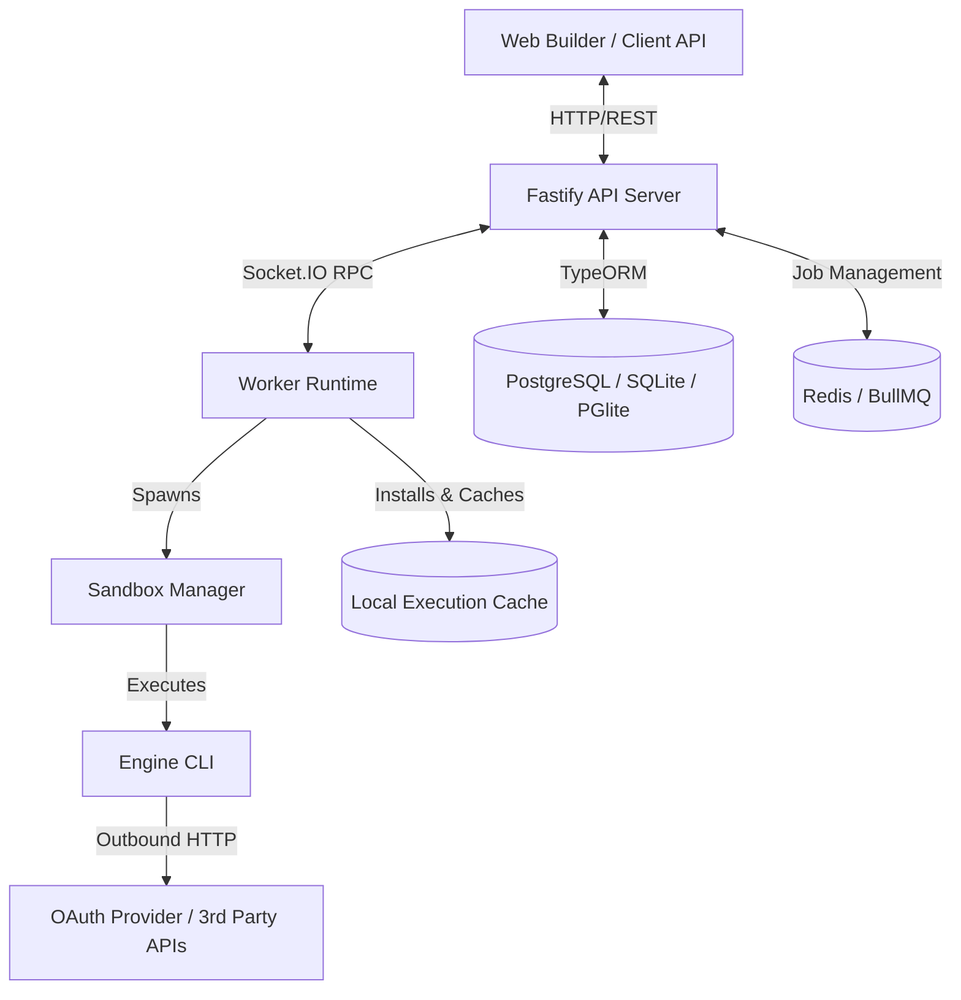
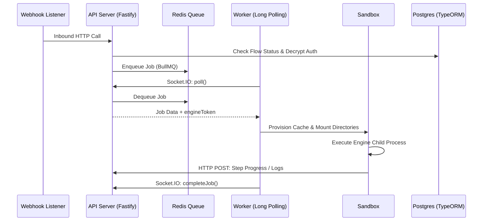
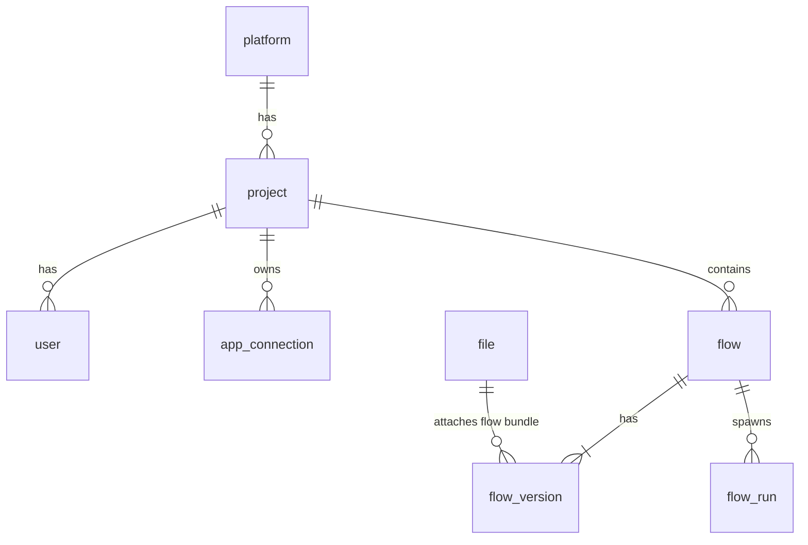
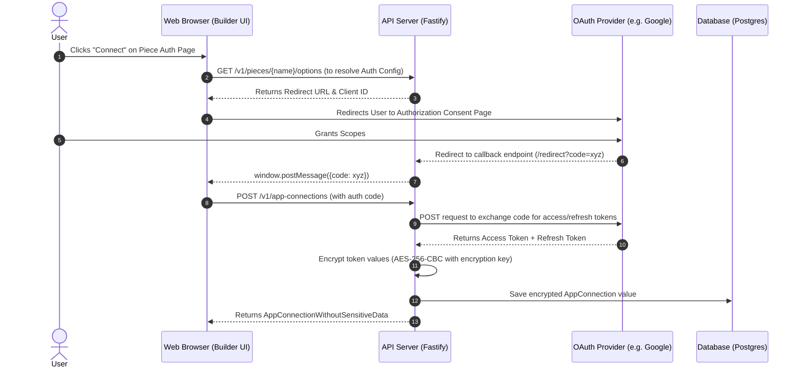
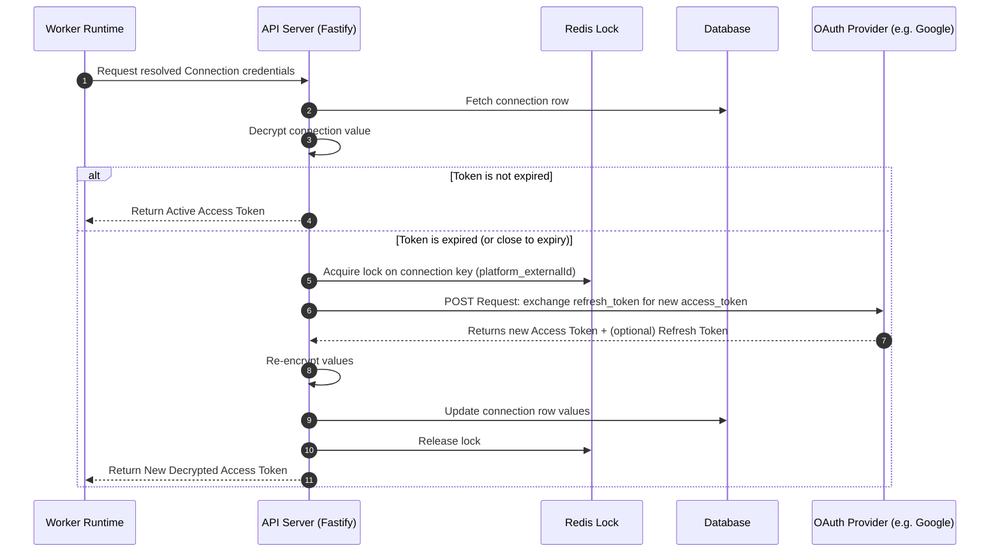
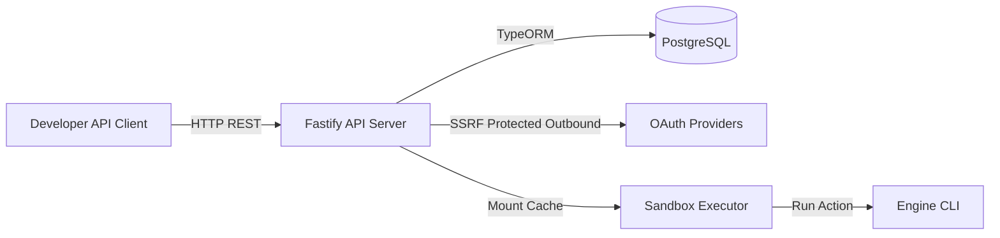

# Activepieces Architecture Analysis

This document provides a comprehensive analysis of the architectural design, directory structure, data flow, and subsystems of the Activepieces codebase.

---

## 1. High Level Architecture

Activepieces is an open-source, AI-first workflow automation platform designed to connect applications, execute multi-step logic (flows), and run AI integrations. 

### Major Services
1. **API Server (Fastify 5)**: Manages authentication, metadata, flow versioning, user dashboard APIs, and serves frontend assets. It exposes a Socket.IO namespace that manages bi-directional communications with executing Workers.
2. **Worker Runtime**: A long-polling socket client running in replica container instances. The worker pulls jobs from Redis (via BullMQ routed through the API server), downloads required pieces, caches provisions, and spawns local execution sandboxes.
3. **Execution Sandbox**: Hosts single-tenant runs. It can run in `UNSANDBOXED` mode, `SANDBOX_CODE_ONLY` mode, or inside isolated environments utilizing `isolate` namespaces/cgroups or `isolated-vm` for high-security execution.
4. **Engine CLI**: A standalone, bundleable engine runner that imports, verifies, and runs a single action or trigger. It operates entirely on-disk in the sandbox, interacting with external APIs directly.
5. **Redis (BullMQ)**: Manages delayed execution queues, repeating schedulers (cron), rate limiting metadata, and pub-sub messaging.
6. **PostgreSQL / SQLite / PGlite**: Transactional relational stores for tenants, configurations, flows, runs, and credentials.

### Runtime Architecture Diagram



### Package Structure and Monorepo Layout
Activepieces uses npm/bun workspaces to coordinate a multi-package monorepo:
* **`packages/web`**: Single Page Application written in React, Vite, Tailwind CSS, Shadcn UI, and Zustand.
* **`packages/server/api`**: Core Fastify API server and modules (CE + EE features).
* **`packages/server/worker`**: Socket-based long-polling job handler.
* **`packages/server/sandbox`**: Sandbox manager, local cache manager, and `isolate` process orchestrator.
* **`packages/server/engine`**: In-sandbox runtime engine executing actions.
* **`packages/server/utils`**: Core server utilities (Structured logging, SSRF protection, version compatibility).
* **`packages/core/shared`** (`@activepieces/shared`): Models, Zod schemas, TypeORM entities, and sharing types between frontend/backend.
* **`packages/core/execution`**: Core types for flows, versions, run timelines, and execution states.
* **`packages/core/piece-types`**: Core piece specifications.
* **`packages/core/formula`**: Expression compiler and calculator.
* **`packages/core/utils`**: Thinnest, framework-agnostic utility library.
* **`packages/pieces/framework`**: Declarative SDK used by integration developers to author Actions, Triggers, Properties, and Auth blocks.
* **`packages/pieces/*`**: Over 400 community, core, and custom integration packages.
* **`packages/ee/embed-sdk`**: Frontend SDK for iframe-based white-label embedding.

### Overall Request Lifecycle
1. **Flow Triggered**: An inbound webhook arrives at `POST /v1/webhooks` or a polling scheduler fires, adding a task with `flowVersionId` to BullMQ.
2. **Worker Handshake**: A Worker container polling the API server over Socket.IO receives the job data and a short-lived `engineToken`.
3. **Provisioning**: The Worker checks its local cache. If the `flowVersion` is locked and cached as a compiled Flow Bundle, it extracts it. If missing, it downloads the flow definition, installs dependencies (pieces, code steps) using `bun install` locally, and builds the bundle.
4. **Execution**: The Sandbox Manager forks a Node process (using `isolate` sandboxing if configured) to execute the Engine CLI.
5. **Result Dispatch**: The Engine posts execution updates and progress logs directly to Fastify endpoints (`/v1/engine/*`). Upon completion, the worker reports the final state back via Socket.IO `completeJob`.

---

## 2. Folder Structure

### Top-Level Folders
* **`.agents/`**: Contains domain bounded-contexts, agent instructions, and context metadata.
* **`.claude/`** / **`.cursor/`** / **`.vscode/`**: IDE specific settings, project rules, and configurations.
* **`assets/`**: Media files, icons, logos.
* **`benchmark/`**: Load testing configs and execution benchmarks.
* **`deploy/`**: Configurations for Kubernetes (Helm), Docker Compose, and standalone VM deployments.
* **`docs/`**: API documentations, Engineering Handbook, and Architecture Decision Records (ADRs).
* **`packages/`**: Monorepo workspaces (elaborated below).
* **`scripts/`**: Development utility scripts, migrations, and local tests.
* **`smoke-test/`**: High-level e2e verification pipelines.
* **`tools/`**: Build system tools, code generator scripts (cli-driven piece creators), and publisher shims.

### Package Details

| Package Path | Purpose | local workspace dependencies | What Imports It / Depends on It |
|---|---|---|---|
| `packages/core/utils` | Pure JS/TS core helpers (`isNil`, `apId`, `tryCatch`) | None | Almost all workspaces |
| `packages/core/piece-types` | Types for pieces, trigger strategies, and events | `core-utils` | `pieces-framework`, `shared`, `engine` |
| `packages/core/formula` | Formula parsing (`{{configs.key}}`) and evaluation | `core-utils` | `core-execution`, `engine`, `api` |
| `packages/core/execution` | Types for flows, versions, folders, runs, and note schemas | `core-utils`, `piece-types`, `formula` | `shared`, `engine`, `web`, `api` |
| `packages/core/shared` | Core database schemas, user-facing requests validation schemas | `core-utils`, `core-execution` | `api`, `worker`, `sandbox`, `web`, `cli` |
| `packages/pieces/framework` | SDK for defining Pieces, Actions, and Triggers | `core-utils`, `piece-types` | `pieces/*` integrations, `engine`, `api` |
| `packages/server/utils` | SSRF filters, crypto helpers, evlog logging setup | `shared`, `pieces-framework` | `api`, `worker`, `sandbox`, `engine` |
| `packages/server/sandbox` | Sandbox runner and node modules provisioner | `shared`, `server-utils` | `worker`, `api` |
| `packages/server/engine` | In-sandbox runtime engine executing actions | `shared`, `pieces-framework` | Spawned at runtime by `sandbox` |
| `packages/server/worker` | Socket-based long-polling job handler | `shared`, `sandbox`, `server-utils` | Executed as an independent container |
| `packages/server/api` | API controller endpoints and features | `shared`, `server-utils`, `sandbox` | Spawned as API server container |
| `packages/web` | React Single Page Application | `shared`, `core-execution` | Web browser bundle |

---

## 3. Backend Architecture

### Key Subsystems
1. **API Server**: Fastify 5 instance. Integrates zod verification schema providers. Mounts controllers under feature wrappers (`*.module.ts`).
2. **Worker**: Initiated in `packages/server/worker`. Maintains N poll loops in matching concurrency wrappers. Checks compatibility via `VersionsAreCompatible` prior to polling.
3. **Database Layer**: TypeORM models mapped to PostgreSQL (production), SQLite, or PGlite (local test/dev). Transactions, connections, and custom repositories are built via a `repoFactory`.
4. **Queue**: BullMQ manages `worker-jobs` and `system-job-queue`. Deduplicates requests using memory locks in Redis.
5. **Authentication**: Handled via `authenticationMiddleware` using JWT tokens. Decoded principal scopes regulate Platform/Project permissions.
6. **OAuth Services**: Managed under `app-connection/app-connection-service/oauth2`. Splits into `credentialsOauth2Service` (custom user client credentials), `cloudOAuth2Service` (Activepieces managed Cloud router), and `platformOAuth2Service` (EE-specific OAuth apps registry).
7. **Execution & Trigger Engine**: Core execution triggers flow run models in `core-execution`. Webhooks invoke `webhook.service.ts` to execute matching flow chains.
8. **Scheduler**: repeating job routines in BullMQ query polling triggers or cleanup activities via `systemJobsSchedule`.
9. **Secret Manager**: Enterprise module resolves app connections keys from HashiCorp Vault or AWS Secrets Manager. CE fallback uses standard encrypted values in PostgreSQL.

### Communication Flow


---

## 4. Frontend Architecture

### Technology Stack
* **Framework**: React 18 with React Router v6.
* **State Management**: Zustand handles XYFlow canvas state, step validation states, and chat settings.
* **Component Kit**: Tailwind CSS classes merged via `cn()` wrapper, and Radix UI elements.
* **API Calls**: TanStack Query (React Query) wraps Axios instances configured in `src/lib/api.ts`.
* **Form Validation**: React Hook Form combined with Zod schemas.

### Route Organization
Routes are dynamically resolved in `ApRouter` based on whether the app is running in standard browser mode or in embedding mode (using memory routing in iframe windows).
* `publicRoutes`: Sign-in, sign-up, password reset, and public web templates.
* `projectRoutes`: Builder workspace, execution run views, connections, tables, and settings.
* `platformRoutes`: Tenant-level configuration (projects, users, SAML, SMTP setup).

### API Communication Setup
Axios calls propagate authentication headers using:
```ts
Authorization: "Bearer " + authenticationSession.getToken()
```
The client catches `SESSION_EXPIRED` (401) error codes and redirects the viewport to `/sign-in` instantly.

---

## 5. Database

### ORM
TypeORM coordinates database connections. Table mappings are explicitly registered in `packages/server/api/src/app/database/database-connection.ts` inside `getEntities()`.

### Core Tables & Relationships
* **`platform`**: Platform configuration details.
* **`project`**: Logical project groups containing flows, users, and connections. Belongs to a platform (`platformId`).
* **`user`** & **`user_identity`**: Users and login records. Users belong to a platform and can be assigned to multiple projects via project members.
* **`app_connection`**: Stores encrypted connection credentials. Scoped by `platformId` and `projectIds` array.
* **`flow`** & **`flow_version`**: Stores visual diagram step mappings. A flow version belongs to a flow and contains a hierarchical step trigger configuration.
* **`flow_run`**: Holds execution states, timers, step outputs, and logs.
* **`file`**: Stores flow bundle tarballs, custom pieces binaries, and execution logs.
* **`table`**, **`field`**, **`record`**, **`cell`**: Embedded low-code table database engines.



---

## 6. OAuth System

Activepieces supports three types of OAuth connections:
1. **Developer Owned Credentials (`OAUTH2`)**: The user registers their own client details (ID & Secret) inside the connection popup.
2. **Cloud Managed Proxy (`CLOUD_OAUTH2`)**: Leverages Activepieces' hosted router to exchange credentials directly via `secrets.activepieces.com`.
3. **Platform Registered Apps (`PLATFORM_OAUTH2`)**: Platform admins configure OAuth credentials globally, and tenant projects inherit them seamlessly.

### OAuth Connection Creation Lifecycle



### Token Refresh Lifecycle



---

## 7. Pieces / Integrations

A **Piece** is a structured typescript module defined using the `@activepieces/pieces-framework` SDK. It exports a `Piece` object that registers Actions, Triggers, and Authentication Properties.

### Piece Loading and Verification
* **Retrieval**: During sandbox provisioning (`local-execution-cache.ts`), the Worker resolves piece dependencies. Official pieces are downloaded from npm. Custom archives are streamed from the API server's File storage as `.tgz` files.
* **Loading**: The Engine CLI loads piece directories using dynamic ECMAScript imports:
  ```ts
  const module = await import(piecePath);
  const piece = extractPieceFromModule(module);
  ```
* **Authentication**: Pieces declare authorization styles (`PieceAuthProperty`). At run time, input validations filter credentials into `auth` scopes available within the Action context.
* **Actions & Triggers**:
  * **Actions**: Implement `run()` methods containing API calls.
  * **Triggers**: Implement `onEnable()` (e.g., creating webhooks), `onDisable()`, and `run()` (processing webhook payloads or pulling periodic items).
* **Dynamic Properties**: Actions can define dynamic properties that invoke REST calls to retrieve live options (e.g., loading lists of folders or projects from Slack/Trello dynamically in the builder).

---

## 8. Workflow Engine

### Flow Definitions
Activepieces stores flows as recursive trees:
```ts
export const FlowTrigger = z.union([PieceTrigger, EmptyTrigger]);
// A Trigger holds a reference to the next execution step:
nextAction: FlowAction | undefined
```
Actions can be of type:
* `Piece`: Invokes an integration Action.
* `Code`: Compiles and runs arbitrary JavaScript/TypeScript.
* `LoopOnItems`: Iterates over an array.
* `Router`: Contains branching logic (conditional paths).

### Step Execution Mechanics
When a workflow job is executed, the Engine CLI constructs a `PropsResolver` class. Prior to invoking a step, the resolver processes input properties:
* String interpolations (e.g., `{{step_1.output.body}}`) are evaluated against the current state of execution (Step Output caches).
* Data values are parsed through `packages/core/formula` parsing engines.
* The matching executor (e.g. `pieceExecutor`, `codeExecutor`) runs the step code.
* If a step fails, retry parameters or `continueOnFailure` flags are evaluated. If a waitpoint (such as an approval step) is hit, execution pauses, the state is persisted, and waitpoint records are saved.

---

## 9. API

### Key REST Endpoints

#### Authentication
* `POST /v1/authentication/sign-in` — Authenticates user credentials.
* `POST /v1/authentication/sign-up` — Provisions new platform users.
* `POST /v1/authentication/switch-project` — Changes active project scopes.

#### Flow Management
* `POST /v1/flows` — Creates flow instances.
* `GET /v1/flows` — Lists flows (filterable by project or folder).
* `POST /v1/flow-versions/{versionId}/actions` — Modifies flow version layouts.
* `POST /v1/flows/{id}/publish` — Publishes drafts and builds Flow Bundles.

#### Flow Runs
* `POST /v1/flow-runs` — Triggers test execution instances.
* `GET /v1/flow-runs/{id}` — Retrieves execution status and individual step outputs.

#### App Connections
* `POST /v1/app-connections` — Creates or updates connection credentials.
* `GET /v1/app-connections` — Lists project connection details.

#### Pieces
* `GET /v1/pieces` — Lists active piece integrations.
* `POST /v1/pieces/install` — Installs custom piece files.

#### Webhooks
* `POST /v1/webhooks` — Processes inbound event payloads.

---

## 10. Dependency Graph

The package dependency structures highlight `@activepieces/core-utils`, `@activepieces/pieces-framework`, and `@activepieces/shared` as the core foundations.

```mermaid
graph TD
    classDef core fill:#8142E3,stroke:#fff,stroke-width:2px,color:#fff;
    
    utils[@activepieces/core-utils]:::core
    types[@activepieces/core-piece-types]:::core
    framework[@activepieces/pieces-framework]:::core
    execution[@activepieces/core-execution]:::core
    shared[@activepieces/shared]:::core
    
    formula[@activepieces/core-formula]
    server-utils[@activepieces/server-utils]
    sandbox[@activepieces/sandbox]
    engine[@activepieces/engine]
    worker[worker]
    api[api-server]
    web[web-frontend]

    types --> utils
    framework --> utils
    framework --> types
    formula --> utils
    execution --> utils
    execution --> types
    execution --> formula
    shared --> utils
    shared --> execution
    server-utils --> shared
    server-utils --> framework
    sandbox --> shared
    sandbox --> server-utils
    engine --> shared
    engine --> framework
    worker --> shared
    worker --> sandbox
    worker --> server-utils
    api --> shared
    api --> server-utils
    api --> sandbox
    web --> shared
    web --> execution
```

---

## 11. Execution Lifecycle

This walkthrough explains step-by-step what happens when a User configures a Gmail connection and executes an action.

```
[ User Clicks: Connect Gmail ] 
       │
       ▼
[ Browser opens google auth window ]
       │
       ▼
[ User grants access permissions ]
       │
       ▼
[ Google redirects callback with code ]
       │
       ▼
[ API Exchanges authorization code for Token ]
       │
       ▼
[ Encrypted Credentials saved in app_connection table ]
       │
       ▼
[ User runs Gmail action (Flow Run Triggered) ]
       │
       ▼
[ Job enqueued to BullMQ. Worker polls socket and fetches Job ]
       │
       ▼
[ API decrypts and refreshes OAuth Token (if expired) ]
       │
       ▼
[ Worker provisions environment, downloads Engine & Gmail piece ]
       │
       ▼
[ Engine runs within Sandbox, invokes Gmail ActionRunner ]
       │
       ▼
[ Action calls Google APIs using Access Token Bearer ]
       │
       ▼
[ Execution returns result JSON. Worker updates Flow Run status ]
```

---

## 12. Feature Separation

The table below maps core features to the files/directories responsible for their implementation:

| Feature | Primary Location | Key Code Symbols / Files |
|---|---|---|
| **OAuth** | `packages/server/api/src/app/app-connection/app-connection-service/` | `oauth2/` directory, `oauth2Handler` |
| **Credential Storage** | `packages/server/api/src/app/app-connection/` | `app-connection.entity.ts`, `app-connection-service.ts` |
| **Secrets & Encryption** | `packages/server/api/src/app/helper/` | `encryption.ts` (`encryptUtils`), `secret-managers/` (EE) |
| **Workflow Builder** | `packages/web/src/app/builder/` | `Builder`, `Canvas`, `Zustand FlowState` |
| **Flow Runner** | `packages/server/worker/src/lib/` | `worker.ts`, `getHandler()`, `execute/` directory |
| **Scheduling** | `packages/server/api/src/app/helper/system-jobs/` | `system-job.ts`, `systemJobsSchedule` |
| **Queue** | `packages/server/api/src/app/workers/job-queue/` | `job-queue.ts`, `job-broker.ts`, `bullboard.ts` |
| **Triggers** | `packages/server/api/src/app/trigger/` | `trigger-source/`, `trigger-event.service.ts` |
| **Actions** | `packages/pieces/framework/src/lib/action/` | `action.ts`, `createAction()` |
| **Integrations** | `packages/pieces/` | `community/`, `core/`, `framework/` directories |
| **Frontend Builder** | `packages/web/src/app/builder/` | `Canvas`, `tiptap-editor.tsx`, `step-settings/` |
| **Execution Engine** | `packages/server/engine/` | `main.ts`, `handler/` directory (`piece-executor.ts`) |
| **API** | `packages/server/api/src/app/` | `app.ts`, feature-specific controllers |
| **Workers** | `packages/server/worker/src/` | `bootstrap.ts`, `lib/worker.ts` |

---

## 13. Removal Analysis

This section analyzes the feasibility and impact of removing specific subsystems if Activepieces were refactored into a simpler system.

### Workflow Builder
* **Can it be removed safely?** **YES**
* **What breaks?** The visual diagram designer UI. Creating multi-step visual workflows, managing step connections, and draft/publish controls on the canvas would no longer function.
* **Dependencies**: `packages/web/src/app/builder/`, `packages/server/api/src/app/flows/`, `packages/core/execution/`
* **Estimated effort**: **High** (requires removing all editor pages and visual routes while retaining raw execution capabilities).

### Scheduler
* **Can it be removed safely?** **YES**
* **What breaks?** Repeating cron schedules and polling triggers. Triggers would rely entirely on immediate webhook push events.
* **Dependencies**: BullMQ Repeating schedulers, `systemJobsSchedule`, `trigger-source/`
* **Estimated effort**: **Medium** (requires decoupling the scheduling loops from the core worker initialization logic).

### Canvas UI
* **Can it be removed safely?** **YES**
* **What breaks?** Visual interface elements, XYFlow configurations, and visual debugging tools.
* **Dependencies**: React Flow (XYFlow), `canvas-state.ts`, list of custom component blocks
* **Estimated effort**: **Medium** (requires deleting the builder route folder and replacing it with basic execution/history panels).

### Triggers
* **Can it be removed safely?** **NO**
* **What breaks?** Webhook event reception and routing. Webhooks are the primary way external platforms inform the system of events.
* **Dependencies**: `webhooks/` directory, `trigger-event.service.ts`, `app-event-routing/`
* **Estimated effort**: **High** (if removed, actions can only be executed by manual, synchronous API calls).

### Flow Engine
* **Can it be removed safely?** **YES**
* **What breaks?** The ability to chain multiple actions together. Execution would be limited to running a single Action step at a time.
* **Dependencies**: `engine/src/lib/handler/flow-executor.ts`, `core-execution` schemas
* **Estimated effort**: **High** (requires rewiring the execution path to directly invoke piece run actions).

### Execution Workers
* **Can it be removed safely?** **YES**
* **What breaks?** Asynchronous background execution. Executions would run synchronously within Fastify's HTTP threads.
* **Dependencies**: `worker` workspace, BullMQ Redis connections
* **Estimated effort**: **High** (requires converting the execution runner to run in-process rather than via sockets).

### Variables
* **Can it be removed safely?** **YES**
* **What breaks?** Output resolution mappings. Action configuration inputs would have to be passed as static JSON payloads.
* **Dependencies**: `core-formula`, `packages/server/api/src/app/variable/`
* **Estimated effort**: **Medium** (requires removing the step resolver maps).

### Conditions
* **Can it be removed safely?** **YES**
* **What breaks?** Conditional branching steps (`Router` steps).
* **Dependencies**: `router-executor.ts`
* **Estimated effort**: **Low** (requires deleting the router executor and removing branch types).

### Loops
* **Can it be removed safely?** **YES**
* **What breaks?** The `LoopOnItems` action.
* **Dependencies**: `loop-executor.ts`
* **Estimated effort**: **Low** (requires deleting the loop executor and removing loop step schemas).

---

## 14. Minimal Connect Version

To build a lightweight integration runtime (similar to Pipedream Connect) focused on **OAuth**, **Credential Storage**, **Integration Registry**, and **Action Execution** via a REST API, we can remove the visual editor and multi-step execution subsystems.

### Core Workspaces and Files to KEEP
1. **`packages/pieces/*` & `packages/pieces/framework`**: We need these to keep the integrations and the SDK structure.
2. **`packages/core/utils` & `packages/core/piece-types`**: Core utilities and basic types.
3. **`packages/server/utils`**: For SSRF protection (`safeHttp`) and logger setups.
4. **`packages/server/sandbox`**: We still need sandbox cache setups (`piece-installer.ts`, `local-execution-cache.ts`) to download and cache integration files on-disk.
5. **`packages/server/engine`**: To execute a single action. We can simplify the runner to bypass flow step traversal and directly execute the piece action runner (`piece-executor.ts`).
6. **`packages/server/api` (Modified)**:
   - **Keep**: `app-connection/` (decryption, claim, and refresh logic), `pieces/` (install and query pieces), `database/` (Postgres schema definitions).
   - **Add**: A new execution endpoint `POST /v1/execute-action` which runs a single action within a sandbox.

### Workspaces and Files to DELETE
1. **`packages/web/`**: The entire React frontend can be deleted. It can be replaced with a lightweight administration dashboard, or the platform can run completely headless.
2. **`packages/cli/`**: CLI tool packages are not needed.
3. **`packages/core/formula/` & `packages/core/execution/`**: Deletes all expression resolvers, loops, branches, and flow schemas.
4. **`packages/server/worker/`**: Long-polling socket worker models can be removed. Action execution can run in-process (synchronously) or via a simpler, local thread runner.
5. **`packages/server/api/src/app/flows/`**: Deletes all flows, flow runs, flow versions, waitpoints, and folder models.
6. **`packages/server/api/src/app/template/` & `packages/server/api/src/app/store-entry/`**: Deletes workflow template sharing features.
7. **`packages/server/api/src/app/ee/git-repo/` & `packages/server/api/src/app/ee/projects/project-release/`**: Deletes Git sync and multi-project deployments.

This refactoring would result in the removal of approximately **65% of the codebase**, leaving a clean, headless integration engine.

---

## 15. Extension Points

Activepieces provides clean extension patterns:
1. **The Piece SDK (`pieces-framework`)**: The primary way to extend the system. Adding new integrations requires implementing a defined interface:
   ```ts
   export const createPiece = (params: CreatePieceParams) => new Piece(params);
   ```
2. **Hooks Factory**: Features in the Enterprise Edition (EE) hook into Community Edition (CE) structures dynamically without directly importing EE modules.
   ```ts
   // packages/server/api/src/app/helper/hooks-factory.ts
   export const projectHooks = new Hooks<ProjectHooks>();
   ```
   During boot, the API server registers the enterprise hooks dynamically (`projectHooks.set(projectEnterpriseHooks)`).
3. **SSRF Guard**: Custom request rules can be registered in `packages/server/utils/src/safe-http.ts` to whitelist specific domains or enforce network filtering patterns.

---

## 16. Final Summary

### 1. High-Level Core Architecture


### 2. Pipedream Connect Mode Recommended Architecture
If Activepieces were converted into a lightweight, headless Integration Platform:
1. **Synchronous Execution**: The Fastify HTTP server handles action execution requests synchronously. When `POST /v1/execute-action` is called, the server allocates a sandbox locally, runs the action, and returns the result in the HTTP response. This removes the need for BullMQ, Redis queues, and socket workers for basic setups.
2. **Platform Managed OAuth**: Retains the platform-oauth2 controller so clients can authenticate integrations using the host's client keys, and queries return active access tokens directly to developer applications.
3. **Decoupled Engine**: The Engine CLI is simplified to a single-action runner, bypassing flow traversal, step validations, and state history logs.

**Estimated codebase reduction**: **~65%** of the repository could be removed.
