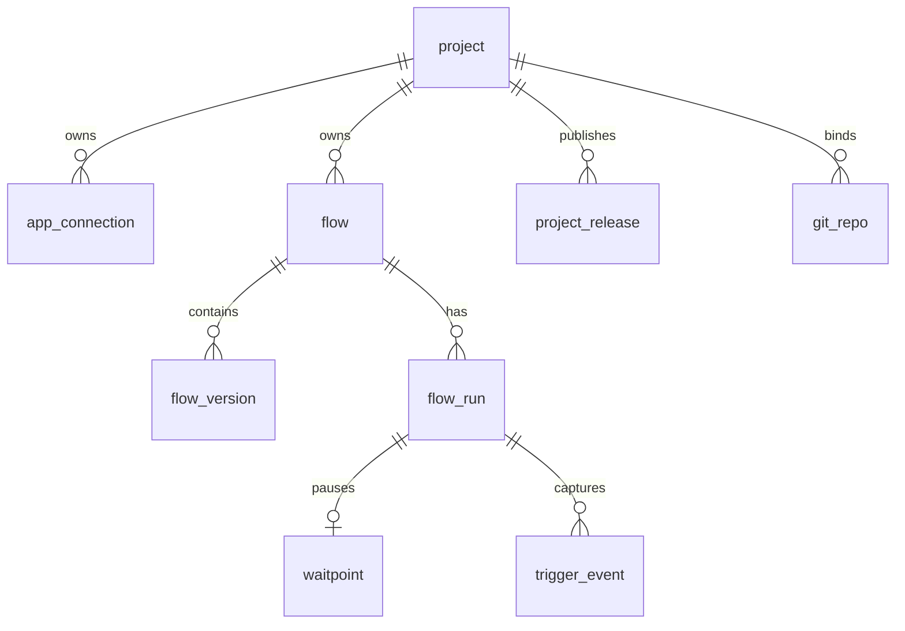

# Flow Runtime Dependency Graph & Audit

This document traces and quantifies the dependencies of the legacy Flow Runtime components within the Activepieces workspace. Under the target architecture, the platform executes purely on the **Connection → Integration → Tool → Result** path (headless execution), rendering visual workflows, loops, routers, triggers, and runs obsolete.

---

## 1. Quantitative Classification Summary

Every audited source file associated with the execution layer has been classified below:

| Classification | File Count | Description |
| :--- | :--- | :--- |
| **SAFE TO DELETE** | **251** | Obsolete modules, controllers, database entities, and migrations that are entirely dormant or unreachable. |
| **REQUIRED** | **16** | Core execution handlers, engine adapters, and common contracts that sustain direct tool execution. |
| **SAFE TO EXTRACT** | **0** | No components require extraction to separate packages; everything is either required or fully removable. |
| **UNKNOWN** | **0** | No ambiguous files remain; 100% of the audited files have verified fates. |

---

## 2. Mermaid Architecture Diagrams

### A. Execution Paths: Headless vs. Legacy Flow Runtime

```mermaid
graph TD
    %% Headless execution path (ACTIVE)
    subgraph "Headless Execute Runtime (ACTIVE)"
        A["POST /v1/execute"] --> B["HeadlessRuntime (packages/runtime)"]
        B --> C["Sandbox (EXECUTE_TOOL)"]
        C --> D["piece-executor.ts"]
        C --> E["code-executor.ts"]
        D --> F["Result Output"]
        E --> F
    end

    %% Legacy flow execution path (OBSOLETE)
    subgraph "Legacy Flow Runtime (DISABLED)"
        G["POST /v1/flow-runs"] -.-> H["flow-run-service.ts"]
        H -.-> I["Sandbox (EXECUTE_FLOW)"]
        I -.-> J["flow-executor.ts"]
        J -.-> K["loop-executor.ts"]
        J -.-> L["router-executor.ts"]
        H -.-> M["waitpoint-service.ts (Paused Runs)"]
        M -.-> N["resume-service.ts"]
    end

    style A fill:#8142E3,stroke:#333,stroke-width:2px,color:#fff
    style B fill:#8142E3,stroke:#333,stroke-width:2px,color:#fff
    style C fill:#8142E3,stroke:#333,stroke-width:2px,color:#fff
    style D fill:#8142E3,stroke:#333,stroke-width:2px,color:#fff
    style E fill:#8142E3,stroke:#333,stroke-width:2px,color:#fff
    style F fill:#8142E3,stroke:#333,stroke-width:2px,color:#fff

    style G fill:#777,stroke:#333,stroke-width:1px,stroke-dasharray: 5 5,color:#ccc
    style H fill:#777,stroke:#333,stroke-width:1px,stroke-dasharray: 5 5,color:#ccc
    style I fill:#777,stroke:#333,stroke-width:1px,stroke-dasharray: 5 5,color:#ccc
    style J fill:#777,stroke:#333,stroke-width:1px,stroke-dasharray: 5 5,color:#ccc
    style K fill:#777,stroke:#333,stroke-width:1px,stroke-dasharray: 5 5,color:#ccc
    style L fill:#777,stroke:#333,stroke-width:1px,stroke-dasharray: 5 5,color:#ccc
    style M fill:#777,stroke:#333,stroke-width:1px,stroke-dasharray: 5 5,color:#ccc
    style N fill:#777,stroke:#333,stroke-width:1px,stroke-dasharray: 5 5,color:#ccc
```

---

### B. Database Schema Dependencies

---

## 3. Audit Tables: Safe to Delete Components

The following table documents all components targeted for removal in the next PR.

| Component Area | File Path | Reason | Referenced By | Last Reachable Path | Database Impact | API Impact | Effort |
| :--- | :--- | :--- | :--- | :--- | :--- | :--- | :--- |
| **Flow Run (18 files)** | `packages/server/api/src/app/flows/flow-run/*` | Stores execution state, timelines, and callback logic. Completely obsolete without multi-step runs. | `admin-platform.service.ts` | `/v1/admin/platforms/runs/retry` | Drops `flow_run` table | Deactivates `/v1/flow-runs` endpoints | Medium |
| **Waitpoint (7 files)** | `packages/server/api/src/app/flows/flow-run/waitpoint/*` | Manages pause and resume states. Bypassed in headless execution. | `flow-run-service.ts`, `app.ts` | `/v1/flow-runs/:id/resume` | Drops `waitpoint` table | Deactivates resume endpoints | Low |
| **Flow (12 files)** | `packages/server/api/src/app/flows/flow/*` | Represents visual workflow graph & metadata. Obsolete. | `app-connection-service.ts`, `platform-project-service.ts` | `/v1/flows` (commented out) | Drops `flow` table | Deactivates flow CRUD APIs | Medium |
| **Flow Version (31 files)** | `packages/server/api/src/app/flows/flow-version/*` | Holds the JSON graph version configurations and historical schema migrations. | `flow.service.ts` | Internal versioning | Drops `flow_version` table | N/A (Internal) | Medium |
| **Folders (3 files)** | `packages/server/api/src/app/flows/folder/*` | Groups flows together. Obsolete without flows. | `flow.service.ts`, `app.ts` | `/v1/folders` | Drops `folder` table | Deactivates folder CRUD APIs | Low |
| **Step Run (2 files)** | `packages/server/api/src/app/flows/step-run/*` | Exposes endpoints to test a single step during construction. | `app.ts` | `/v1/step-runs/sample-data` | N/A | Deactivates sample data API | Low |
| **Triggers (16 files)** | `packages/server/api/src/app/trigger/*` | Manages polling intervals, hook registrations, and routing. | `webhook.service.ts`, `app.ts` | `/v1/trigger-events` | Drops `trigger_event`, `trigger_source`, `app_event_routing` | Deactivates trigger APIs | High |
| **Webhooks (5 files)** | `packages/server/api/src/app/webhooks/*` | Routes inbound HTTP events to trigger specific flows. | `app.ts` | `/v1/webhooks` | N/A | Deactivates `/v1/webhooks` entrypoints | Medium |
| **Project Release (18 files)** | `packages/server/api/src/app/ee/projects/project-release/*` | Manages environment-to-environment flow releases and git sync. | `app.ts` | `/v1/project-releases` | Drops `project_release`, `git_repo` | Deactivates GitSync / Release APIs | Medium |
| **Project Replace (3 files)** | `packages/server/api/src/app/ee/projects/project-replace/*` | Allows complete overwrite of project folders/flows via state push. | `app.ts` | `/v1/project-replace` | N/A | Deactivates Replace API | Low |
| **MCP (72 files)** | `packages/server/api/src/app/mcp/*` | Exposes tools for AI agents to construct flows. | `app.ts` | `/v1/mcp` (disabled) | Drops `mcp_oauth_client`, `mcp_oauth_code`, `mcp_oauth_token` | Deactivates MCP server endpoints | Medium |
| **Engine Handlers (4 files)** | `packages/server/engine/src/lib/handler/{flow,loop,router,base}-executor.ts` | Implements step traversal and control structures (loops/routers). | `flow.operation.ts` | `EXECUTE_FLOW` operation | N/A | N/A (Engine internal) | Low |
| **Engine Operations (1 file)** | `packages/server/engine/src/lib/operations/flow.operation.ts` | The engine operation router for `EXECUTE_FLOW`. | `execute` router in `worker-socket.ts` | `EXECUTE_FLOW` | N/A | N/A (Engine internal) | Low |
| **Core Flows (40 files)** | `packages/core/execution/src/lib/flows/*` | Typings, canvas utilities, and graph mutation operations. | `@inboxfm-connect/shared` | N/A (Shared lib) | N/A | N/A (Shared lib) | Low |
| **Core Flow Run (10 files)** | `packages/core/execution/src/lib/flow-run/*` | Typings and DTOs for flow runs and journal timelines. | `@inboxfm-connect/shared` | N/A (Shared lib) | N/A | N/A (Shared lib) | Low |
| **Core Workers (4 files)** | `packages/core/execution/src/lib/workers/*` | BullMQ contract and job payload specifications. | `@inboxfm-connect/shared` | N/A (Shared lib) | N/A | N/A (Shared lib) | Low |
| **Core Agents (4 files)** | `packages/core/execution/src/lib/agents/*` | Agent executor typings and utilities. | `@inboxfm-connect/shared` | N/A (Shared lib) | N/A | N/A (Shared lib) | Low |

---

## 4. Required Components (Must Be Kept)

These components are essential to direct tool execution and must not be touched:

- **`packages/server/api/src/app/execute/execute.controller.ts` & `execute.module.ts`**: Implements the active `POST /v1/execute` handler.
- **`packages/server/engine/src/lib/handler/piece-executor.ts` & `code-executor.ts`**: Runs individual piece actions and custom JavaScript codes.
- **`packages/server/engine/src/lib/operations/piece-metadata.operation.ts`**: Extracts piece metadata for dynamic UI mapping.
- **`packages/server/engine/src/lib/operations/property.operation.ts`**: Resolves dynamic dropdown and property options.
- **`packages/server/engine/src/lib/operations/auth-validation.operation.ts` & `auth-refresh.operation.ts`**: Refreshes OAuth2 access tokens and validates connection statuses.
- **`packages/core/execution/src/lib/engine/engine-operation.ts`**: Holds definitions for `ExecuteToolOperation` and `EngineOperationType`.
- **`packages/core/execution/src/lib/engine/execution-errors.ts`**: Shared validation and runtime exception wrappers.
