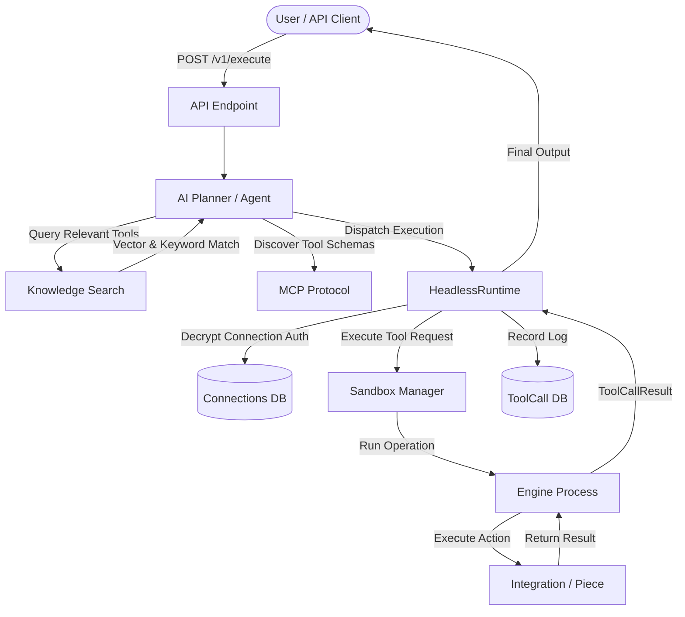
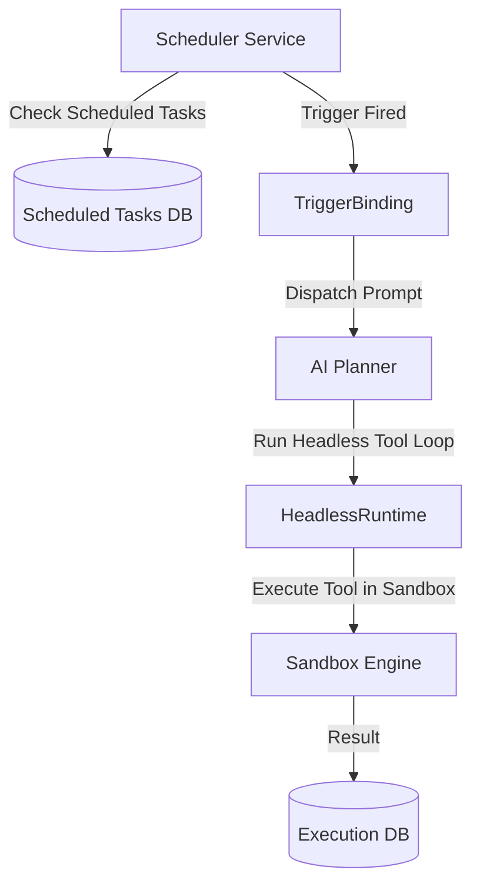
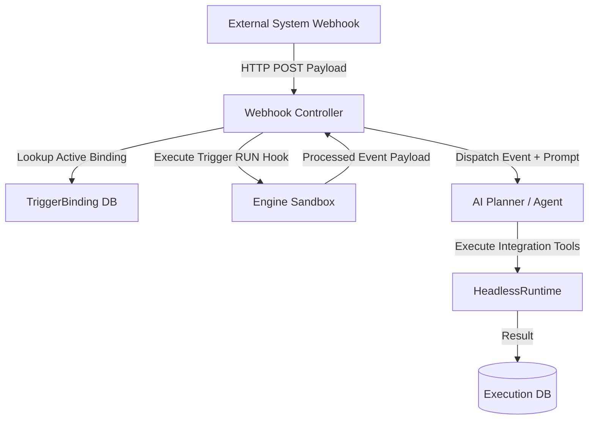
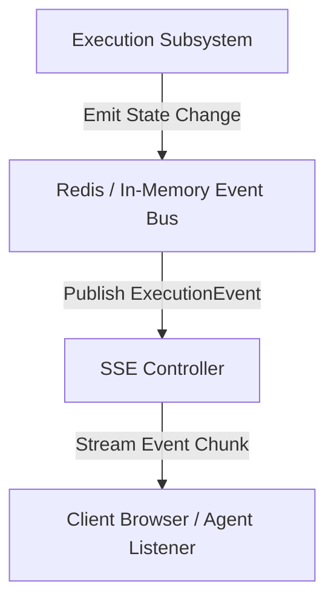
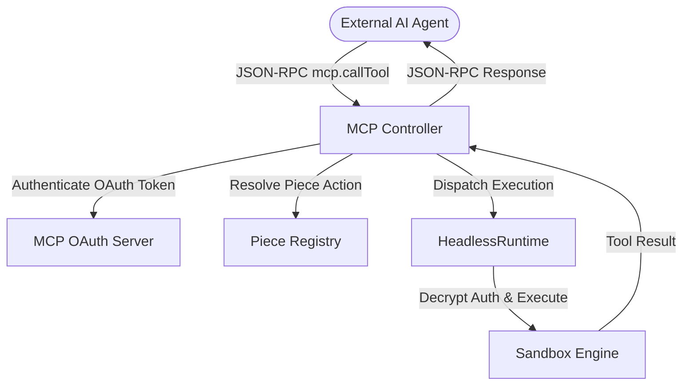

# Headless Target Dependency Graph — InboxFM Connect

## 1. Overview & Verification

This document illustrates the target architectural flow across all execution modes of InboxFM Connect.

**Zero Graph Policy**:
All target dependency graphs contain **ZERO** references to `Flow`, `FlowVersion`, `FlowRun`, `Router`, `Loop`, or visual canvas elements.

---

## 2. Mermaid Target Architecture Diagrams

### Diagram A: Direct Prompt Execution Path

### Diagram B: Scheduled Execution Path

### Diagram C: Webhook Execution Path

### Diagram D: Execution Progress (SSE) Path

### Diagram E: MCP Headless Tool Execution Path

