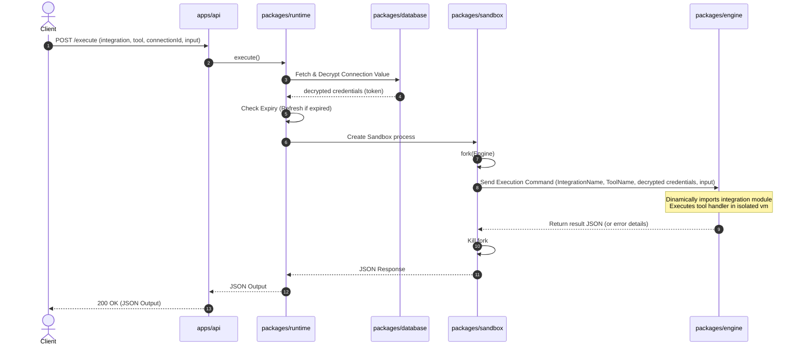

# Target Architecture Design (NEW_ARCHITECTURE.md)

This document describes the clean, SDK-first target architecture of the headless Integration Platform optimized for AI agent tool execution.

---

## 1. Directory Structure

```
activepieces/
├── apps/
│   └── api/                # Fastify REST API server
├── packages/
│   ├── oauth/              # Handles credential authentication & refresh
│   ├── registry/           # Manages integration metadata & dynamic loads
│   ├── runtime/            # Synchronous child process execution wrapper
│   ├── framework/          # Integration & Tool Developer SDK
│   ├── integrations/       # Shared common helpers for providers (HTTP, formats)
│   └── database/           # Pruned TypeORM engine schemas & db connections
├── providers/              # SDK-first integrations folder
│   ├── gmail/
│   │   ├── manifest.ts     # Declares name, categories, auth reference, and tools
│   │   ├── auth.ts         # Authentication configuration and properties
│   │   └── tools/          # Individual tool modules
│   │       ├── sendEmail.ts
│   │       └── listMessages.ts
│   └── slack/
│       ├── manifest.ts
│       ├── auth.ts
│       └── tools/
│           └── postMessage.ts
└── package.json
```

---

## 2. Dynamic Sandbox Tool Execution Lifecycle

To guarantee host system security, integrations must run inside an isolated process.



---

## 3. Provider SDK Schema Design

Every provider is constructed as an SDK-first bundle:

### Example: `providers/gmail/manifest.ts`
```typescript
import { createIntegration } from '@activepieces/framework';
import { gmailAuth } from './auth';
import { sendEmail } from './tools/sendEmail';

export const gmail = createIntegration({
  displayName: 'Gmail',
  logoUrl: 'https://cdn.activepieces.com/pieces/gmail.png',
  auth: gmailAuth,
  tools: [sendEmail],
});
```

### Example: `providers/gmail/tools/sendEmail.ts`
```typescript
import { createTool, Property } from '@activepieces/framework';

export const sendEmail = createTool({
  name: 'send_email',
  displayName: 'Send Email',
  description: 'Send an email through your Gmail account',
  props: {
    to: Property.ShortText({
      displayName: 'To',
      required: true,
    }),
    subject: Property.ShortText({
      displayName: 'Subject',
      required: true,
    }),
    body: Property.LongText({
      displayName: 'Body',
      required: true,
    }),
  },
  async run(context) {
    const response = await context.safeHttp.post('https://gmail.googleapis.com/...', {
      to: context.propsValue.to,
      subject: context.propsValue.subject,
      body: context.propsValue.body,
    }, {
      headers: {
        Authorization: `Bearer ${context.auth}`,
      }
    });
    return response.body;
  },
});
```

---

## 4. Runtime API Specifications

The `packages/runtime` package exposes only:

```typescript
export interface HeadlessRuntime {
  /**
   * Loads the connection, validates/refreshes credentials,
   * forks the sandbox, and executes the specified tool.
   */
  execute(params: ExecuteParams): Promise<JSON>;

  /**
   * Persists a new connection value into the database.
   */
  connect(params: ConnectParams): Promise<ConnectionMetadata>;

  /**
   * Revokes and removes the connection.
   */
  disconnect(params: DisconnectParams): Promise<void>;

  /**
   * Refreshes expired credentials using the provider configuration.
   */
  refreshToken(params: RefreshParams): Promise<ConnectionMetadata>;

  /**
   * Lists the tools exposed by the given integration.
   */
  listTools(params: ListParams): Promise<ToolMetadata[]>;

  /**
   * Returns a decrypted connection object (useful for debugging).
   */
  getConnection(params: GetConnectionParams): Promise<ConnectionMetadata>;
}
```
